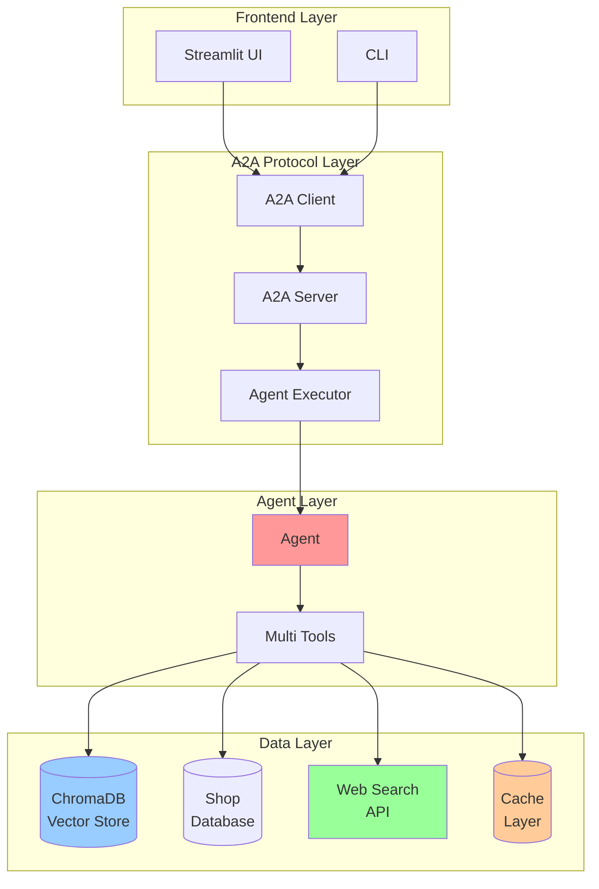

# 🤖 A2A Agent System

<div align="center">


**An enhanced A2A Agent system with RAG, Web Search, and Streamlit Interface**

</div>

---

## 🎯 Introduction

The **A2A Agent** is an advanced Agent-to-Agent system that integrates cutting-edge AI features:

### 🔄 **Preserves the A2A Framework:**
- ✅ Complete A2A SDK and protocol
- ✅ Agent Card system and task management
- ✅ Message handling and push notifications
- ✅ Fully compatible with the A2A ecosystem

### 🚀 **Enhanced with Modern AI:**
- 🧠 **True RAG**: Vector search with ChromaDB + Gemini embeddings
- 🌐 **Web Search**: Integrated Serper API for real-time information
- 📊 **Performance Monitoring**: Detailed metrics and analytics
- 🎨 **Streamlit Frontend**: Modern web interface
- 💾 **Intelligent Caching**: Optimized performance
- 🏗️ **Modular Architecture**: Easy to extend and maintain

---

## ✨ Key Features

### 🔍 **RAG System**
```python
# Vector similarity search with Gemini embeddings
🔍 Query: "What is the price of the iPhone 15 Pro Max?"
📊 Vector Search: ChromaDB similarity matching
🎯 Results: Top 5 related products with confidence scores
💡 Response: Detailed information with prices, specs, and promotions
```

### 🌐 **Web Search Integration**
```python
# Real-time information retrieval
🌍 Query: "Latest tech news today"
🔍 Web Search: Serper API → Google Search
📰 Results: Top 3 latest articles
📝 Response: Summarized information from multiple sources
```

### 🏪 **Smart Shop Information**
```python
# Intelligent store information
📍 Query: "What are the opening hours of the store in Hoang Mai?"
🗄️ Database: Structured shop data
📋 Results: Address, opening hours, services, contact details
🗺️ Response: Complete information + Google Maps link
```

### 📊 **Performance Monitoring**
```python
# Real-time performance monitoring
📈 Metrics: Request count, response time, success rate
💾 Cache: Hit rate, TTL optimization
🎯 Tools: RAG vs Web Search usage tracking
🔧 Debug: Tool execution tracing
```

---

## 🏗️ Architecture



### 📦 **Project Structure:**
```
a2a-langgraph-langchain/
├── 📁 backend/                    # Core A2A backend
│   ├── 📁 agents/                 # Agent implementations
│   │   ├── agent.py              # Main LangGraph agent with RAG
│   │   └── __init__.py
│   ├── 📁 data/                   # Data management layer
│   │   ├── vector_store.py        # ChromaDB integration
│   │   └── __init__.py
│   ├── 📁 core/                   # Core configurations
│   │   ├── config.py              # Settings management
│   │   └── __init__.py
│   ├── agent_executor.py          # A2A executor with monitoring
│   ├── main.py                    # A2A server entry point
├── 📁 frontend/                   # Modern Streamlit interface
│   ├── streamlit_app.py           # Main Streamlit app
├── 📁 scripts/                    # Setup and utility scripts
│   ├── build_vector_db.py         # Vector DB builder
├── 📁 data/                       # Data storage
│   ├── vector_db/                 # ChromaDB storage
├── .env.example                   # Environment template
├── .gitignore                     # Git ignore rules
├── pyproject.toml                 # Project configuration
└── README.md                      # This file
```

---

## 🚀 Quick Start

### 📋 **System Requirements:**
- Python 3.13+
- 4GB RAM (8GB+ recommended)
- 2GB disk space
- Internet connection (for web search)

### 🔧 **Automatic Installation:**
```bash
# 1. Clone the repository
git clone https://github.com/trngthnh/a2a-langgraph-langchain.git
cd a2a-langgraph-langchain

# 2. Copy environment variables
cp .env.example .env

# 3. Configure API keys
# Edit .env with your API keys

# 4. Create the virtual environment
uv venv .venv

# Activate venv
.venv/Scripts/activate

# 5. Install dependencies
uv pip install --project

# 6. Build vector database
uv run scripts/build_vector_db.py

# 7. Run the backend
uv run backend/main.py

# 8. Run the frontend in a separate terminal
streamlit run frontend/streamlit_app.py
```

### 🔐 **Required API Keys:**

#### **Google Gemini API (Required)**
```bash
# Obtain from: https://makersuite.google.com/app/apikey
GOOGLE_API_KEY=your_google_gemini_api_key_here
```

#### **Serper API (Optional - for web search)**
```bash
# Obtain from: https://serper.dev/dashboard
SERPER_API_KEY=your_serper_api_key_here
```
---

## 💡 Usage

**Example chat:**
```
🤖 A2A Agent v0.1.0
💬 What would you like to ask?

💭 Give me information about the iPhone 15 Pro Max
🔍 Searching product database with vector similarity...
📱 iPhone 15 Pro Max Information:
   💰 Price: $1199
   🔧 Chip: A17 Pro
   📷 Camera: 48MP Main
   🔋 Battery: Up to 29 hours of video playback
   🎨 Colors: Natural Titanium, Blue, White, Black
   ⚡ Confidence: 0.95 | ⏱️ 1.2s | 📚 Vector Database

💭 What are the opening hours of the store in Hoang Mai?
🏪 Retrieving shop information...
📍 Store in Hoang Mai:
   • Hoang Ha Mobile - Tam Trinh: 8:30-21:30
   • Hoang Ha Mobile - Truong Dinh: 8:30-21:30
   📞 Contact: 024 3868 7777
   🗺️ Maps: https://maps.app.goo.gl/...
   ⚡ Confidence: 1.0 | ⏱️ 0.8s | 🗄️ Shop Database
```

### 🎨 **Streamlit Web Interface**

**Web interface features:**
- 💬 **Chat Interface**: Modern chat interface with markdown support
- 📊 **Analytics Dashboard**: Real-time performance charts
- ⚙️ **System Panel**: System control and configuration
- 🐛 **Debug Mode**: Detailed tool execution and metadata
- 📁 **File Upload**: Upload and process data files
- 💾 **Export**: Export conversation data and metrics

---

## 🔧 Configuration

The project's configuration is managed through environment variables. Create a `.env` file in the project root based on the `.env.example` template.

---

## 📈 Performance

The `backend/agent_executor.py` file provides performance metrics:

```python
def get_performance_metrics(self) -> Dict[str, Any]:
    """Get current performance metrics"""
    total_requests = max(1, self.performance_metrics['total_requests'])  # Avoid division by zero

    return {
        'total_requests': self.performance_metrics['total_requests',
        'successful_requests': self.performance_metrics['successful_requests'],
        'failed_requests': self.performance_metrics['failed_requests'],
        'success_rate': self.performance_metrics['successful_requests'] / total_requests,
        'average_response_time': self.performance_metrics['total_response_time'] / total_requests,
        'cache_hit_rate': self.performance_metrics['cache_hits'] / max(1, self.performance_metrics['cache_hits'] + self.performance_metrics['cache_misses'])
    }
```

These metrics include:

- `total_requests`: Total number of requests.
- `successful_requests`: Number of successful requests.
- `failed_requests`: Number of failed requests.
- `success_rate`: Percentage of successful requests.
- `average_response_time`: Average response time per request.
- `cache_hit_rate`: Percentage of requests served from the cache.

You can access these metrics via the `/metrics` endpoint.  See `backend/main.py` for the route definition.

---

## 📞 Support

Email: truongthinhnguyen30303@gmail.com
